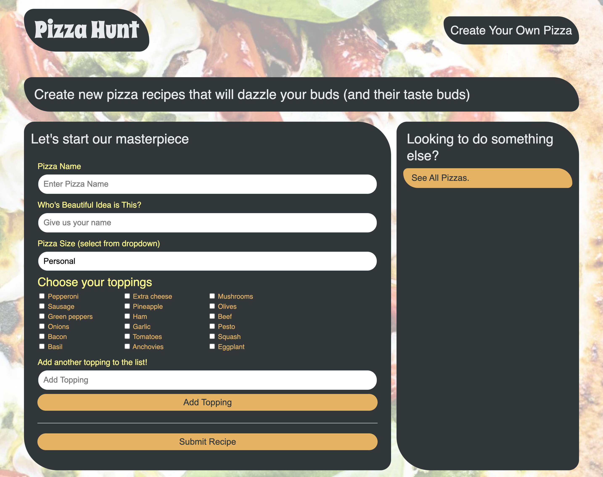

# Pizza Hunt

## Description
Pizza Hunt, a social media recipe app where users can post their creative spins on pizza, add comments to recipes, and create threads within comments. I added back-end functionality to the exsisting front-end.

Instead of using a MySQL database, I used MongoDB, a document-based NoSQL database, and Mongoose, an Object-Document Mapper, to work with unstructured data. I also made this application a PWA, in order to save data locally when there’s no internet connection by using IndexedDB, a NoSQL client-side storage API in the browser.

## Usage

## Built With

* MongoDB
* Mongoose
* IndexedDB
* noSQL
* JavaScript
* MVC Paradigm
* RESTful APIs

## Questions
If you have any questions, please email me at [akelstrom@gmail.com](mailto:akelstrom@gmail.com).

